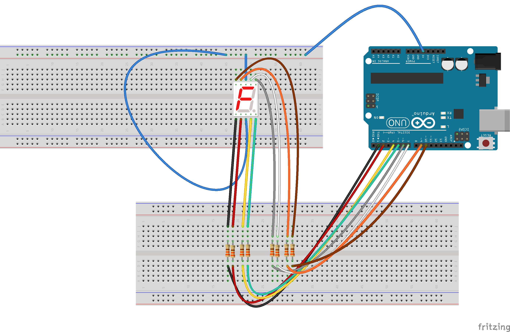
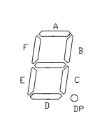

Soda  
====

A Arduino library for 7 segment LED  

This library was made by [Quin](https://github.com/Qtechknow/Arduino-Libraries), the head engineer at Qtechknow.  He made this specifically for using with 7-segment displays.  Share, distribute, and edit for your specific uses. This is an open-source library.  

Some edits done by @fabiantheblind  
I had to pull it into a new repo for better usage. Also I made some major changes to the usage of the pinlayout. See [Quin's original work here.](https://github.com/Qtechknow/Arduino-Libraries)  

Functions:

Soda soda;
  Initiates the library.

soda.pins(int a, int b, int c, int d, int e, int f, int g, int dp);
    Declares and sets up the pins.

soda.write(int number);
    Lights up int number on the 7-Segment display.

soda.setDecimalPoint(int digit, boolean decimalState);
    Sets the decimal point of int digit to boolean decimalState.

Hook the decimal display up like this:  
  
  

